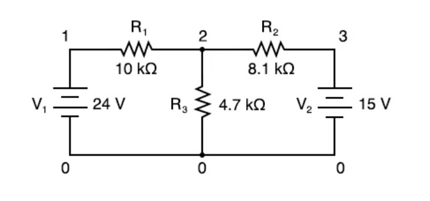
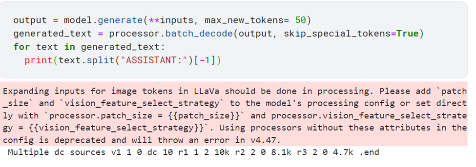
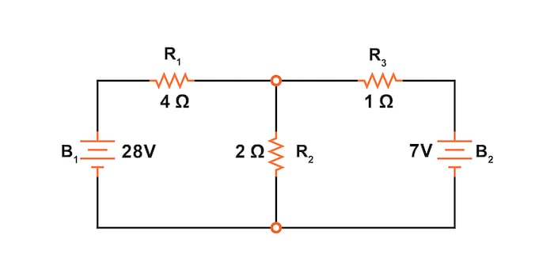

# LLaVa-for-Circuit-Netlist

# About
LLaVA has impressive multimodal capacity. In this project we try to leverage LLaVA-7b in 4 bit-quantized version to solve Electrical circuits.
Here We check the circuit solving and Netlist Generation capability of LLaVA. 

# Circuit Solving Capability

It outputs the following:
>"
In the image, there are two resistors, one at 120 Ohms and the other at 12 Ohms. We can determine the value of R by using the formula R = (V1 \* R1) / (I1 \* t), where V1 is the voltage across the resistor, R1 is the resistance value, I1 is the current flowing through the resistor, and t is the time for which the current flows.
We can calculate the current flowing through the resistor by using the formula I = V / R, where V is the voltage across the resistor and R is the resistance value.
Once we have the current value, we can determine the time for which the current flows by using the formula t = I \* t, where t is the time for which the current flows.
Finally, we can calculate the value of R by using the formula R = (V1 \* R1) / (I1 \* t).
In this case, we have V1 = 10V, R1 = 120 Ohms, I1 = 0.5 A (since the current is flowing through the resistor), and t = 1 second. Plugging these values into the formula, we get R = (10V \* 120 Ohms) / (0.5 A \* 1 second) = 12 Ohms.
"

It is evident that it hallucinates on a circuit-solving question. So, we try to use it to generate a Netlist of the circuit which can be used to solve the circuit in SPICE programs.

# Generating Netlist

>Promt : "Generate a netlist for the circuit \n"
>Output : "Here is a simplified netlist for the circuit:
css
R1 = 12 ohm
R2 = 60 ohm
R3 = 12 ohm
R4 = 12 ohm"

So, the model also hallucinates on Netlist Generation task.

# Finetuning model

We built a small [Dataset](https://www.kaggle.com/datasets/takakib/circuit-for-llava) for finetuning LLaVA for Netlist Generation. We only used 7 images for finetuning. But it yielded quite usuable result for such a small dataset. For finetuning we used the Kaggle P-100 GPU and the following hyperparameters:
_model_id llava-1.5-7b, train_epochs 5, gradient_accumulation_steps 1, learning_rate 5e-4, lora_r 8, lora_alpha 32_

# Get started with the model
The adapter is stored at [HuggingFace](https://huggingface.co/akibc123/llava_for_circuit_netlist). To get started run the [inference code](/Inference_with_online_image.ipynb)

# Results

After finetuning we give the following circuit from training as input to the model

> Output:
> 

The netlist is fine. That is because this image was in the training set. Let's test the model with a random circuit from the internet.

>Output:  Multiple dc sources v1 1 0 dc 24 v2 3 0 dc 12 r1 1 2 4 r2 2 3 7 r3 2 0 1

There are multiple discrepancies in the output. It recognizes all the resistance and the values of them. But it gives incorrect values for Voltage Source. Lack of enough training data might be the reason for that. We'll update the repo when we can improve the result.

